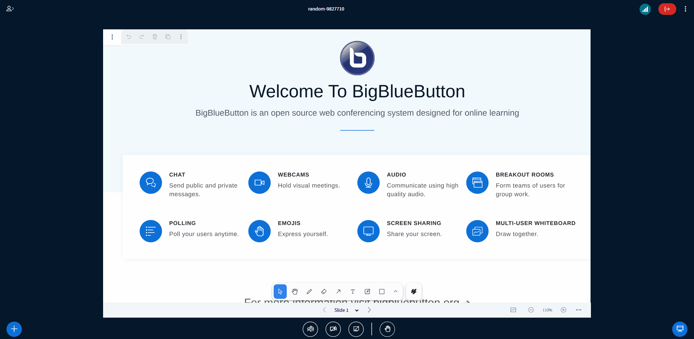

# Tour Plugin

## Description

This plugins adds a button in the options dropdown menu to start a Tour to guide user to some of the features of Bigbluebutton. It uses the [sheperd.js](https://github.com/shepherd-pro/shepherd) library.



You can configure some "Learn More" links that are shown in some steps (screenshare, whiteboard, general) in the settings of the plugin, see example below.

## Building the Plugin

To build the plugin for production use, follow these steps:

```bash
npm ci
npm run build-bundle
```

The above command will generate the `dist` folder, containing the bundled JavaScript file named `TourPlugin.js`. This file can be hosted on any HTTPS server.

Alternatively, you can host the bundled file on the BigBlueButton server by copying dist/TourPlugin.js to the folder /var/www/bigbluebutton-default/assets/plugins. In this case, the <<PLUGIN_URL>> will be https://<your-host>/plugins/TourPlugin.js.

If you install the Plugin separated to the manifest, remember to change the `javascriptEntrypointUrl` in the `manifest.json` to the correct endpoint.

To use the plugin in BigBlueButton, send this parameter along in create call:

```
pluginManifests=[{"url":"<your-domain>/path/to/manifest.json"}]
```

Or additionally, you can add this same configuration in the `.properties` file from `bbb-web` in `/etc/bigbluebutton/bbb-web.properties`

## Development mode

As for development mode (running this plugin from source), please, refer back to https://github.com/bigbluebutton/bigbluebutton-html-plugin-sdk section `Running the Plugin from Source`

## Background

BigBlueButton added supports for plugins in 2025 with BBB 3.0.
Check the official [documentation website](https://docs.bigbluebutton.org) for more information.

This plugin repository was created using the plugin [template repository for BigBlueButton](https://github.com/bigbluebutton/plugin-template) hosted on GitHub.
